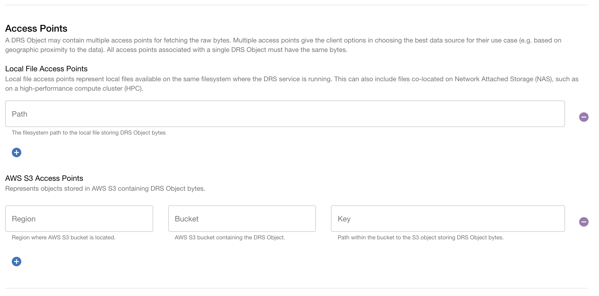
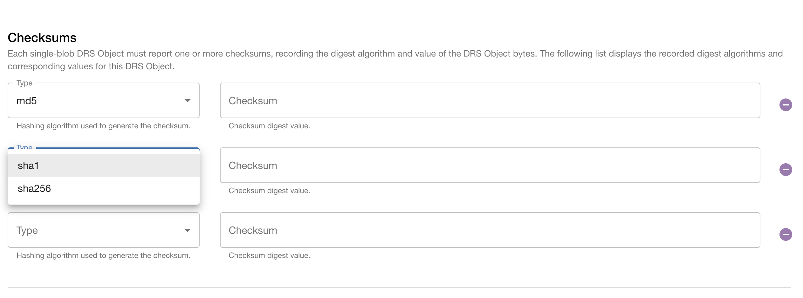
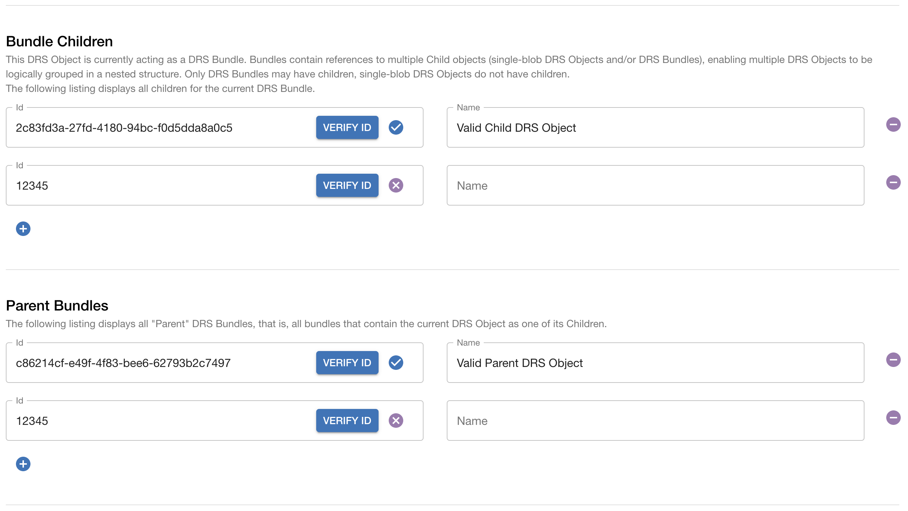
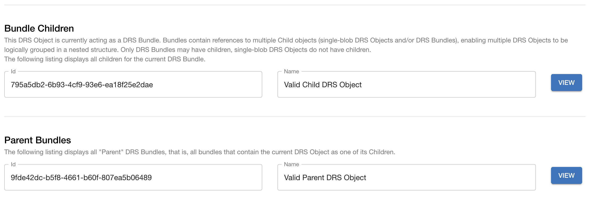

## Getting Started
Ensure that both the DRS Starter Kit API service and the [GA4GH Starter Kit UI](../../starter-kit-ui/starter_kit_ui.md) are running locally, then go to `http://localhost:8989` to access the GA4GH Starter Kit UI.

## Index
`http://localhost:8989/services/{Service Info Id}/drs/objects`

Navigate to the DRS Starter Kit Index page by selecting a DRS Starter Kit Service on the [Services](../../starter-kit-ui/starter_kit_ui.md) page, then select the model "DRS Objects". The DRS Starter Kit Index page displays a table of all of the DRS Objects that are accessible through the current server configuration. Each row of the Index table corresponds to a DRS Object and displays its Id, Name, a View Details button which links to the corrsponding [View DRS Object](drs_starter_kit_ui.md#view-drs-object) page, and an Edit button which links to the corresponding [Edit DRS Object](drs_starter_kit_ui.md#edit-drs-object) page.  
The Index page also displays the New DRS Object button, which renders the [New DRS Object](drs_starter_kit_ui.md#new-drs-object) form.

## New DRS Object
`http://localhost:8989/services/{Service Info Id}/drs/objects/new`

Navigate to the New DRS Object form by clicking the New DRS Object button located at the top left-hand side of the [Index](drs_starter_kit_ui.md#index) page.  
To create a new DRS Object, populate the relevant fields displayed on the DRS Object form and click the Submit button. Note that all DRS Objects must have a unique ID and must be identified as either a Blob or a Bundle. All other fields are optional. See below for more details about the New DRS Object form fields. 

### Id
All DRS Objects must have a unique ID which can be entered in the Id field manually or by clicking the Generate ID button to generate a random UUID. This value cannot be updated after the new DRS Object has been submitted.

### Name, Description, Version, MIME Type
Name, Description, Version, and MIME Type are optional fields, populated via free text entry. Note that MIME Type is only applicable to Blobs.

### Created Time and Updated Time
By default, Created Time and Updated Time are populated with the current time, as of when the New DRS Object page is rendered. To update either of these values, click on the field to open a date-time picker. Any date or time can be selected, however, note that seconds cannot be selected and are therefore automatically set to zero.

_Figure 1: A date-time picker can be used to set the Created Time and Updated Time._

### Blob and Bundle Selector
Use these radio buttons to identify whether the new DRS Object is a Bundle or a Blob. Note that "Blob" is selected by default. Bundles can have child DRS Objects, while Blobs are single DRS Objects and do not have children. This selection cannot be modified after the new DRS Object has been submitted.  

The following property fields are common to both Blobs and Bundles:
- Id
- Name
- Description
- Created Time
- Updated Time
- Version
- Aliases
- Parent Bundles

The following property fields are displayed when "Blob" is selected:
- MIME Type
- Size
- Checksums
- Local File Access Points
- AWS S3 Access Points 

The following property fields are displayed when "Bundle" is selected: 
- Bundle Children

### Size
Size is an optional field which accepts numeric values to represent the size of the new DRS Object in bytes.

### Aliases, Local File Access Points, AWS S3 Access Points
Instances of Aliases, Local File Access Points, and AWS S3 Access Points can each be added to the new DRS Object by clicking the add button corresponding to the property of interest, or removed by clicking the remove button corresponding to the instance to be removed. Each property instance has fields that must be populated via free text entry.

_Figure 2: Examples of the Aliases and Access Points fields, including add and remove buttons._

### Checksums
Each Checksum instance has two fields which must be populated to define the Type and the Checksum value. Checksum instances can be added to the new DRS Object by clicking the add button, or removed by clicking the remove button corresponding to the instance to be removed.    
There are three possible Checksum Types which can be selected using the Type dropdown menu shown below: "md5", "sha1", and "sha256". Each Type can only be selected once, and therefore, a maximum of three Checksum objects can be added. Since each Type can only be chosen once, when a Type field has been populated, that option is hidden from the Type dropdown menu of subsequent Checksum objects.  
The Checksum field can be updated through free text entry and should represent the Checksum digest value corresponding to the selected Type.

_Figure 3: The Type dropdown menu can be used to select each Checksum Type. Each Type can only be selected once, and therefore once it has been selected, it is hidden for all subsequent Checksum objects._

### Parent Bundles and Bundle Children
Parent Bundles and Bundle Children represent the relationship between the new DRS Object and other existing DRS Objects. Parent Bundle and Bundle Child instances can be added to the new DRS Object by clicking the add button, or removed by clicking the remove button corresponding to the instance to be removed.   
Each Parent and Child object has an Id field and a Name field. The Id field can be populated manually and must be validated by clicking the Verify ID button. An Id is determined to be valid if it represents an existing valid DRS Object. Additionally, when adding Parent Bundles, the Id must correspond to another Bundle type DRS Object, as by definition, Blobs cannot have children, and therefore cannot be Parent Bundles. A checkmark icon is displayed to indicate that an Id is valid, while an X icon indicates that the Id is invalid. The Name field cannot be manually updated, but is automatically populated when the corresponding Id is determined to be valid. 

_Figure 4: An example of validation of both valid and invalid sample Parent Bundles and Bundle Children. As shown above, valid related DRS Objects display a checkmark icon, while invalid objects display an X icon._

### Submit New DRS Object Form
Clicking the Submit button verifies that all of the data entered in the New DRS Object form is valid, and if so, makes a POST request to `http://localhost:8080/admin/ga4gh/drs/v1/objects`. The body of the POST request contains the data entered in the New DRS Object form, and if the request is successful, the DRS Object is added to the database. Upon successful POST request, the form displays a success message and redirects to the Index page where the Index table displays the new DRS Object. However, if the request is unsuccessful, the form displays an error message and does not redirect.  
If the initial verification fails prior to submitting the POST request, the form displays an error indicating which part of the form contains invalid data. 

## View DRS Object
`http://localhost:8989/services/{Service Info Id}/drs/objects/{DRS Object Id}`

Navigate to the View DRS Object page by clicking the View button corresponding to the DRS Object of interest in the [Index](drs_starter_kit_ui.md#index) table. The View DRS Object form is populated with the data corresponding to the DRS Object of interest and all fields are read-only.  
Additionally, navigate to the View DRS Object form of Parent Bundles and Bundle Children by clicking the View button next to the related DRS Object of interest, as shown below. 

_Figure 5: Each related DRS Object has a View button which links to the corresponding View DRS Object page._

## Edit DRS Object
`http://localhost:8989/services/{Service Info Id}/drs/objects/{DRS Object Id}/edit`

Navigate to the Edit DRS Object form by clicking the Edit button corresponding to the DRS Object of interest in the [Index](drs_starter_kit_ui.md#index) table, or by clicking the Edit button displayed at the top of the [View DRS Object](drs_starter_kit_ui.md#view-drs-object) page corresponding to the DRS Object of interest.  
The Edit DRS Object form displays all of the property fields corresponding to the DRS Object type (Blob or Bundle), and is populated with the data of the DRS Object to be edited. All fields, except for the Id and Blob and Bundle Selector fields, are editable as outlined in the [New DRS Object](drs_starter_kit_ui.md#new-drs-object) section.

### Submit Edit DRS Object Form
Clicking the Submit button makes a PUT request to `http://localhost:8080/admin/ga4gh/drs/v1/objects/{DRS Object ID}`, if all of the data entered in the form is valid. The body of the PUT request contains the data entered in the Edit DRS Object form and updates the database with the modifications to the DRS Object of interest. If the PUT request is successful, the form displays a success message and redirects to the Index page which displays the updated DRS Object. If the request is unsuccessful, or if initial verification fails prior to making the PUT request, the form displays an error message and does not redirect.

### Delete DRS Object
To delete the current DRS Object, select the Delete button corresponding to the DRS Object of interest in the [Index](drs_starter_kit_ui.md#index) table, or by clicking the Delete button displayed at the top of the [View DRS Object](drs_starter_kit_ui.md#view-drs-object) page corresponding to the DRS Object of interest. Next confirm deletion by selecting the Delete button in the confirmation dialog. Deleting makes a DELETE request to `http://localhost:8080/admin/ga4gh/drs/v1/objects/{DRS Object Id}` and permanently removes the DRS Object from the database. If the DELETE request is successful, the form displays a success message and redirects to the Index page where the deleted object is removed from the Index table.